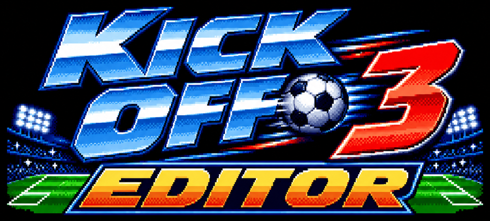

<div align="center">



# Kick Off 3 Editor

**Alle Texte des SNES-Klassikers *Kick Off 3: European Challenge* auslesen, korrigieren und
wieder einsetzen – und endlich die Tippfehler beheben, die einen schon als Kind genervt haben.**


[English](README.md) · [Web-App](#-web-app-ohne-installation) · [Schnellstart](#-schnellstart) · [Bekannte Fehler](#-bekannte-tippfehler--hilfe-willkommen) · [ROM-Notizen](docs/ROM_NOTES.md)

</div>

---

## 🌐 Web-App (ohne Installation)

Lieber klicken als Befehle tippen? Öffne den **Web-Editor** im Browser, ziehe deine ROM hinein,
bearbeite die Texte und lade die korrigierte ROM (oder einen Patch) herunter:

**https://rofldark.github.io/kick-off-3-editor/**

- 🔒 **Deine ROM verlässt nie den Browser.** Es gibt keinen Server: Die Seite besteht nur aus HTML und
  JavaScript und darf nicht einmal Netzwerkanfragen stellen (ihre Content-Security-Policy sagt `connect-src 'none'`).
- ✏️ Menüs, Spieltexte und Spielernamen je Sprache bearbeiten, mit Live-Längenprüfung, Suche,
  Filter „nur geänderte“ und Buttons für Ä Ö Ü Ç.
- 💾 Speichern als korrigierte ROM, `.ips`-/`.bps`-Patch oder als kleine JSON-Datei mit deinen Änderungen.
  Die Änderungen merkt sich der Browser außerdem zwischen den Besuchen (nur die Texte, nie die ROM).
- 🇩🇪 / 🇬🇧 Oberfläche auf Deutsch und Englisch.

Web-App und Kommandozeilen-Tool erzeugen **byte-identische** ROMs (von den Tests geprüft).
Die Web-App läuft auch lokal: einfach `docs/index.html` im Browser öffnen.

> Die Seite wird per GitHub Pages aus dem Ordner `docs/` veröffentlicht.

> *„DEUTSCHE“ im Sprachmenü, „Yuventus“ statt Juventus, „Assesment“ im Team-Screen …*
> Jedem Kind ist das aufgefallen. Jetzt lässt es sich in fünf Minuten beheben.

## ✨ Funktionen

- 📤 **Auslesen** aller Spieltexte in einfache Textdateien, **nach Sprache getrennt** (EN / FR / DE / IT / ES)
- ✏️ **Bearbeiten** in jedem Editor: eine Zeile pro Text, mit angezeigter Maximallänge
- 📥 **Einsetzen** in eine *Kopie* deiner ROM (das Original bleibt unangetastet)
- 🔓 **Längere Texte?** `--repack` packt den Textbereich neu und passt die Index-Tabelle des Spiels an
- 🩹 **Patch-Erzeugung**: `.bps` / `.ips`, um deine Fixes **ohne die ROM** weiterzugeben
- ✅ **Sicher**: strenge Längenprüfung, bei Fehlern wird nichts geschrieben, SNES-Prüfsumme wird automatisch korrigiert
- 🧪 Tests, keine Abhängigkeiten – nur Python

## 🚀 Schnellstart

Du brauchst **Python 3.9+** und **deine eigene ROM**: *Kick Off 3 - European Challenge (Europe) (En,Fr,De,Es,It)*.
(Dieses Repository enthält **keine** ROM, bitte frag auch nicht danach.)

```bash
# 0. Ist es die richtige ROM? (CRC32 1AC7F523)
python kickoff3_text.py info "Kick Off 3.sfc"

# 1. Alle Texte nach ./texte auslesen
python kickoff3_text.py dump "Kick Off 3.sfc" texte

# 2. z. B. texte/1_menus_de.txt bearbeiten (siehe „Die Textdateien“)

# 3. Probelauf – prüft nur, ob alles passt
python kickoff3_text.py verify "Kick Off 3.sfc" texte

# 4. Korrigierte ROM schreiben (eine Kopie!)
python kickoff3_text.py insert "Kick Off 3.sfc" texte "Kick Off 3 - fixed.sfc"

# 5. Optional: aus den Änderungen einen weitergebbaren Patch machen
python kickoff3_text.py patch "Kick Off 3.sfc" "Kick Off 3 - fixed.sfc" my-fixes.bps
```

Patches aus Schritt 5 kann jeder mit seiner eigenen ROM anwenden – mit diesem Tool
(`python kickoff3_text.py apply ROM my-fixes.bps AUS.sfc`) oder mit jedem BPS/IPS-Patcher,
zum Beispiel *Floating IPS* oder *RomPatcher.js* (im Browser).

## 📝 Die Textdateien

`dump` erzeugt eine Datei pro Sprache und Textart:

| Datei | Inhalt | Regel |
|---|---|---|
| `1_menus_en/fr/de/it/es.txt` | Menüs und Optionen je Sprache | Länge ≤ `max` (länger mit `--repack`) |
| `1_menus_shared.txt` | von mehreren Sprachen geteilte Texte (Teams, Länder, „Quit“ …) | wie oben |
| `2_ingame_en/fr/de/it/es.txt` | Texte im Spiel („abseits“, „elfmeter!“ …), zentriert | Länge muss **exakt** gleich bleiben |
| `3_player_names.txt` | 2340 Spielernamen (sprachunabhängig) | ≤ 12 Zeichen, wird automatisch aufgefüllt |

Eine Zeile sieht so aus:

```text
066a71  max=8   |DEUTSCHE|
```

Nur den Text zwischen den Strichen ändern. Der Fix ist dann einfach:

```text
066a71  max=8   |DEUTSCH|
```

- Du kannst mit einer einzelnen Datei arbeiten (z. B. nur `*_de.txt`); unveränderte Zeilen bleiben, wie sie sind.
- Sonderzeichen sind rohe Font-Bytes: als `\xNN` schreiben (z. B. `FRAN\x80AISE`).
  Bei Großbuchstaben beobachtet (entspricht CP437): `\x80` = Ç, `\x8e` = Ä, `\x99` = Ö, `\x9a` = Ü.
- `\\` ist ein Backslash, `\x7c` ein `|`.
- Ein erneutes `dump` in denselben Ordner überschreibt deine Änderungen – vorher wegkopieren.

### Optionen von `insert`

| Option | Wirkung |
|---|---|
| `--pad nul` (Standard) | kürzere Menütexte werden mit Nullbytes aufgefüllt (funktioniert im Spiel einwandfrei) |
| `--pad space` | stattdessen mit Leerzeichen auffüllen |
| `--repack` | **experimentell** – Menütexte dürfen länger werden. Alle Texte werden neu gepackt (gleiche Texte teilen sich Platz), die Index-Tabelle wird neu geschrieben. Etwa 500 Byte Reserve. Bitte im Emulator testen. |

## 🐛 Bekannte Tippfehler – Hilfe willkommen

Bisher in der europäischen ROM gefunden (✅ = im Test-Setup des Tools schon korrigiert, der Rest ist offen):

| Wo | Original | Richtig | Braucht |
|---|---|---|---|
| Sprachmenü (DE) | `DEUTSCHE` | `DEUTSCH` | ✅ in place |
| Sprachliste (DE) | `SPANISCHE` | `SPANISCH` | ✅ in place |
| Teams | `Bilbad` | `Bilbao` | in place |
| Teams | `Yuventus` | `Juventus` | in place |
| Teams | `Nurenberg` | `Nuremberg` / `Nürnberg` | in place (`Nuremberg`) |
| Teams | `Samporia` | `Sampdoria` | `--repack` (+1 Zeichen) |
| Team-Screen | `Assesment` | `Assessment` | `--repack` (+1 Zeichen) |
| Menü (IT) | `SPANGNOLO` | `SPAGNOLO` | in place |
| Im Spiel (IT) | `esplulso` | `espulso` | in place |
| Im Spiel (FR) | `hors jeus` | `hors jeu` (unveränderlich) | in place |
| Teams | `Koln` | `Köln` | Font-Prüfung nötig (Umlaut als Rohbyte) |

Mehr gefunden? Mach ein Issue oder einen Pull Request mit den Offsets aus deinem Dump auf.

## 🔧 Wie es funktioniert (Kurzfassung)

Das Spiel speichert seine Menütexte als normales ASCII in der ROM und spricht sie über
eine **16-Bit-Index-Tabelle** (`0x67378`) an: fünf Blöcke zu je 320 Einträgen, einer pro Sprache.
Texte im Spiel sind Strings fester Breite, Spielernamen 12 Zeichen lange Datensätze.
Das macht diese ROM ungewöhnlich gut editierbar. Alle Details, Offsets und
Reverse-Engineering-Notizen stehen in [docs/ROM_NOTES.md](docs/ROM_NOTES.md).

## 🧪 Tests

```bash
python -m unittest discover tests                            # Python-Tool: nur Unit-Tests
KO3_ROM="Kick Off 3.sfc" python -m unittest discover tests   # volle Tests mit deiner ROM
KO3_ROM="Kick Off 3.sfc" node --test tests/core.test.js      # Web-App-Kern + Vergleich mit dem Python-Tool
```

(PowerShell: `$env:KO3_ROM="Kick Off 3.sfc"`.) Der Node-Test baut dieselben Fixes mit beiden
Implementierungen und verlangt byte-identische ROMs, auch bei `--repack`.

## ⚖️ Rechtliches

Dieses Projekt enthält **nur Werkzeuge und Dokumentation**: keine ROM, keine Text-Dumps und keine
urheberrechtlich geschützten Spieldaten. Du brauchst deine eigene, legal erworbene Kopie des Spiels.
*Kick Off 3* ist Marke bzw. Eigentum der jeweiligen Rechteinhaber; dies ist ein Fanprojekt ohne
Verbindung zu ihnen. Das Titelbild ist eine eigene, vom Stil des Spiels inspirierte Grafik
und keine Kopie. Von dir erzeugte Patches enthalten nur die Unterschiede zur Original-ROM.

## 🤝 Mitmachen

Ideen, Fehlermeldungen, Unterstützung weiterer Regionen/Versionen oder anderer Spiele sind willkommen.
Bitte hänge niemals ROMs oder komplette Text-Dumps an Issues oder Pull Requests an.

## 📄 Lizenz

[MIT](LICENSE) – für die Werkzeuge und die Dokumentation in diesem Repository.
